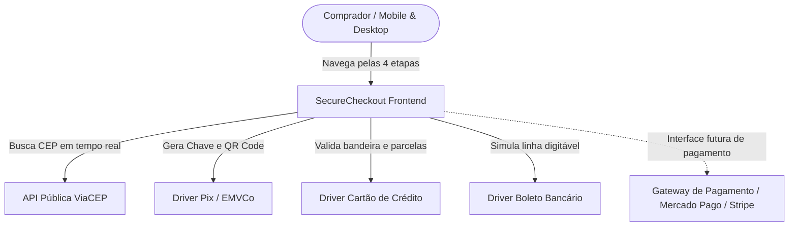

# Arquitetura do Sistema — SecureCheckout

> **Documento de Arquitetura Técnica** elaborado por **Tony Stark** (`wize-agent-architect`). Define componentes, fluxo de dados, contratos de interface e Decisões de Arquitetura (ADRs) para o modelo de checkout da loja.

---

## 1. Visão Geral e Contexto do Sistema (C4 Model)



### Princípios Norteadores da Arquitetura
1. **Zero-Dependency Runtime:** O cliente roda sem overhead de bibliotecas pesadas de terceiros, garantindo TTI (Time-to-Interactive) inferior a 500ms em redes móveis 3G/4G brasileiras.
2. **State-Driven UI:** O estado do checkout é a única fonte de verdade; mudanças no carrinho, frete ou cupom disparam recálculo e renderização reativa imediata.
3. **Fail-Safe & Progressive Enhancement:** A busca de CEP falha de forma graciosa caso a rede do usuário oscile, permitindo preenchimento manual sem travamento.

---

## 2. Decomposição de Componentes

### 2.1. `CheckoutStateManager` (`app.js`)
* **Responsabilidade:** Manter o estado global unificado da sessão de checkout.
* **Propriedades gerenciadas:**
  * `currentStep`: `1 | 2 | 3 | 4`
  * `cart`: Lista de itens, subtotal monetário e itens de demonstração.
  * `shipping`: Opção selecionada, preço e prazo de entrega.
  * `discount`: Percentual e código de cupom ativo.
  * `customer`: Dados validados de identificação e endereço.
  * `payment`: Método escolhido (`pix`, `card`, `boleto`) e metadados.

### 2.2. `FormValidationService`
* **Responsabilidade:** Validação pura e aplicação de máscaras dinâmicas de input.
* **Algoritmos implementados:**
  * Validação algorítmica de CPF por Módulo 11 (cálculo de dois dígitos verificadores e rejeição de sequências repetidas).
  * Máscaras inteligentes reativas para Telefone `(00) 00000-0000` e CEP `00000-000`.
  * Validação de cartão: algoritmo e identificação de bandeiras via prefixos BIN (*Visa: 4, Mastercard: 51-55/22-27, Elo: 4011/4389/etc.*).

### 2.3. `ShippingIntegrationService`
* **Responsabilidade:** Comunicação assíncrona com `https://viacep.com.br/ws/{cep}/json/`.
* **Tratamento de Exceções:** Timeout controlado de 3 segundos com liberação imediata dos campos manuais caso o serviço externo esteja indisponível.

### 2.4. `PaymentEngine` (Adapter Pattern)
* **`PixDriver`:** Renderização de QR Code em SVG vetorial de alta definição, geração de chave de cópia segura com API `navigator.clipboard` e temporizador regressivo de 15 minutos com autolimpeza de memória (`clearInterval`).
* **`CreditCardDriver`:** Espelho visual interativo com animação de foco, cálculo dinâmico de parcelas (1x a 6x sem juros; 7x a 12x com juros compostos de 1.99% a.m.).
* **`BoletoDriver`:** Geração de linha digitável padrão FEBRABAN simulada e cálculo dinâmico da data de vencimento (D+3 dias úteis).

---

## 3. Esquemas de Dados e Contratos (Data Contracts)

### Contrato do Pedido Consolidado (`OrderPayload`)
```typescript
interface OrderPayload {
  orderId: string;           // ex: "#PED-839214"
  createdAt: string;         // ISO 8601
  customer: {
    name: string;
    email: string;
    phone: string;
    cpf: string;             // Máscara 000.000.000-00 validada
  };
  shippingAddress: {
    cep: string;
    street: string;
    number: string;
    complement?: string;
    neighborhood: string;
    city: string;
    state: string;           // UF (2 caracteres)
    selectedMethod: string;  // "pac" | "sedex" | "transportadora"
    cost: number;
    estimatedDays: string;
  };
  payment: {
    method: "pix" | "card" | "boleto";
    totalPaid: number;
    details: PixDetails | CardDetails | BoletoDetails;
  };
  items: Array<{
    id: string;
    title: string;
    quantity: number;
    unitPrice: number;
  }>;
  financialSummary: {
    subtotal: number;
    discount: number;
    shippingCost: number;
    grandTotal: number;
  };
}
```

---

## 4. Decisões de Arquitetura (ADRs)

| Código | Título | Status | Contexto | Decisão |
| :--- | :--- | :--- | :--- | :--- |
| **ADR-001** | Vanilla Framework vs. React/Next | **Aprovado** | Checkout precisa de alta performance e compatibilidade | Usar Vanilla HTML5/CSS3/ES6+ para carregamento em < 500ms |
| **ADR-002** | Guest Checkout sem Senha | **Aprovado** | Redução da taxa de abandono de carrinho | Autenticação por e-mail/CPF sem cadastro prévio obrigatório |
| **ADR-003** | Gateway Adapter Pattern | **Aprovado** | Flexibilidade para múltiplos provedores | Isolar a camada de pagamento para plugar Mercado Pago, Stripe ou Pagar.me |

---

## 5. Segurança, Privacidade e LGPD

1. **Proteção de Dados do Cartão (PCI-DSS):** O número completo do cartão e código de segurança (CVV) são processados exclusivamente na memória do cliente e jamais gravados em `localStorage` ou `sessionStorage`.
2. **Conformidade LGPD:** Coleta mínima estrita — apenas os dados fundamentais para emissão de comprovante e entrega postal física são requisitados.
3. **Prevenção de Injeção e XSS:** Todos os valores inseridos pelo usuário no formulário são tratados como texto puro (`textContent`), bloqueando qualquer tentativa de injeção de scripts.
